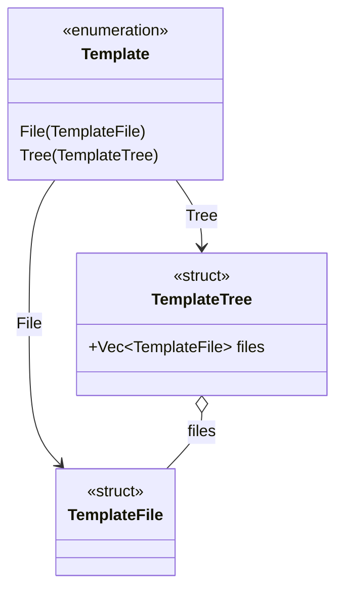

# Template Aspect

```mermaid
classDiagram
direction TB
    class TemplateFile {
    }

    class Template {
	    File(TemplateFile)
	    Tree(TemplateTree)
    }

    class TemplateTree {
	    +Vec~TemplateFile~ files
    }

	<<struct>> TemplateFile
	<<enumeration>> Template
	<<struct>> TemplateTree

    Template --> TemplateFile : File
    Template --> TemplateTree : Tree
    TemplateTree o-- TemplateFile : files
```
