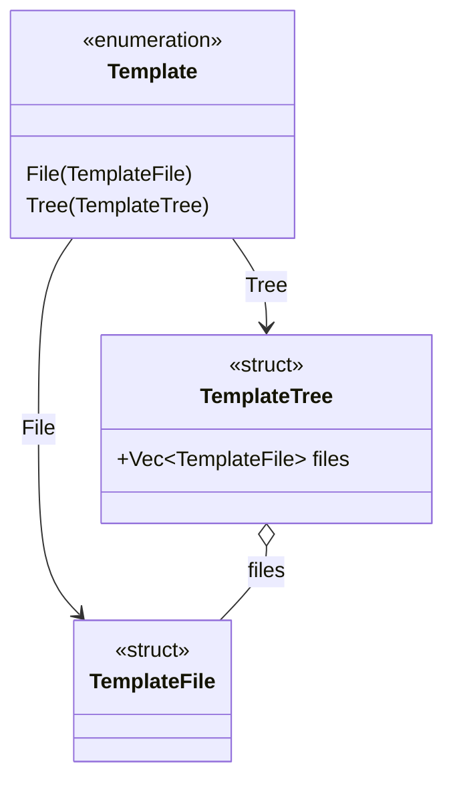

# Template Aspect

## CLI usage

Use the CLI to inspect output with `nmcr gen template_id --print` or to materialize files with positional arguments and `--out` for the destination root, for example:

```
nmcr gen component name=Button --out ./generated
```


